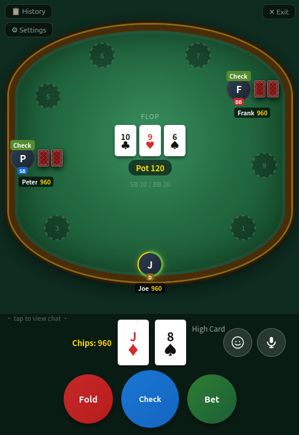

[English](./README.md) · [中文](./README.zh.md)

# 德州扑克 ♠



浏览器中的实时多人德州扑克。无需注册，分享 6 位数字房间码即可开始游戏。

## 功能

- 每局最多 9 名玩家，支持观战与座位选择
- 完整规则：盲注、边池、全押、操作倒计时、断线重连保护
- 可配置起手筹码、大盲注、买入上限，筹码耗尽可随时再次买入
- 游戏中可站起/入座，房主可调整设置或提前结束游戏
- 历史牌局面板，可回顾每一局结果
- **文字聊天** —— 游戏中与等待室均可聊天，消息跨界面共享
- **表情气泡** —— 发送浮动表情，全场玩家可见
- **语音聊天** —— 基于 WebRTC 的按住通话（P2P Mesh，服务端仅中转信令）
- 双语界面 —— 中文（`GAME_LANG=zh`）或英文（默认）
- **PWA** —— 可安装至 iOS / Android 主屏，首次加载后支持离线使用

## Docker Compose

```yaml
services:
  texas-holdem:
    image: dasabihub/texas-holdem-web:latest
    ports:
      - "3003:3003"   # HTTP
      - "3448:3448"   # HTTPS
    volumes:
      - /证书目录:/cred:ro   # 可选，详见下方 HTTPS 说明
    environment:
      - GAME_LANG=zh   # zh | en（默认）
    restart: unless-stopped
```

```bash
docker compose up -d
# HTTP:  http://localhost:3003
# HTTPS: https://localhost:3448  （需要挂载证书）
```

## HTTPS 配置

当容器内 `/cred/server.key` 和 `/cred/server.crt` 文件存在时，HTTPS 会自动启用。将宿主机的证书目录以只读方式挂载即可：

```yaml
volumes:
  - /etc/ssl/my-certs:/cred:ro
```

该目录需包含以下两个文件：

```
server.key   # 私钥
server.crt   # 证书（如需请包含完整证书链）
```

若未找到证书文件，服务器仅在 3003 端口提供 HTTP 服务，3448 端口不启用。

## 本地运行

```bash
npm install
node server.js               # 英文，仅 HTTP
GAME_LANG=zh node server.js  # 中文，仅 HTTP
```

本地启用 HTTPS 时，将 `server.key` 和 `server.crt` 放置于宿主机的 `/cred/` 目录后正常启动即可。

## PWA 安装

移动端：点击浏览器 **分享 → 添加到主屏幕**（iOS），或浏览器安装提示（Android/Chrome）。

## 技术栈

Node.js · Express · Socket.IO · 原生 JS（无框架）
